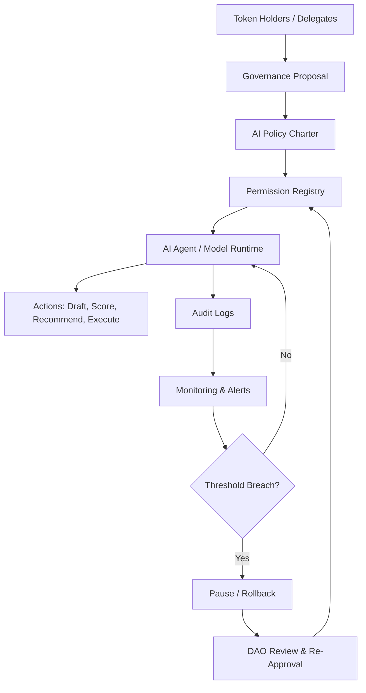

---
title: AI Governance for Protocol DAOs
repo: future-of-ai-and-web3
primary_keyword: AI Governance
secondary_keywords:
- Web3 Research
- DAO Models
- Emerging Technology
slug: ai-governance-for-protocol-daos
word_count_target: 1200
commit_type: 'research(ai):'---

# AI Governance for Protocol DAOs

## Introduction

AI Governance is becoming a practical concern for protocol DAOs that deploy models, agent systems, or automated decision layers into production. As decentralized networks add AI-driven features—such as risk scoring, treasury automation, content moderation, and agent coordination—the governance surface expands beyond token voting and smart contract upgrades. Protocol leaders now need a framework for deciding who can approve model changes, how performance is measured, and what happens when an AI system behaves unpredictably.

For founders and CTOs, the core question is not whether AI should be used, but how to govern it without compromising decentralization, safety, or protocol credibility. The answer requires combining Web3 Research, DAO Models, and Emerging Technology practices into a governance design that is auditable, upgradeable, and resistant to capture.

## Problem Statement

Protocol DAOs were originally optimized for governance of code, capital, and community incentives. AI introduces new failure modes that are harder to inspect than smart contracts. A model may drift after retraining, produce biased outputs, or respond differently under adversarial prompts. An autonomous agent may execute transactions based on incomplete context, creating financial or reputational damage.

The governance challenge has four dimensions:

1. **Opacity**: Unlike deterministic smart contracts, AI decisions are probabilistic and often difficult to explain.
2. **Speed mismatch**: Token governance is slow, while AI systems may need rapid intervention during incidents.
3. **Accountability gaps**: It is unclear whether responsibility sits with model builders, DAO delegates, infrastructure providers, or token holders.
4. **Upgrade risk**: Model updates can quietly change system behavior without the visibility typically expected in on-chain operations.

Without AI Governance, a protocol DAO may end up with a system that is technically decentralized but operationally unaccountable. That weakens trust, especially when AI is used in treasury management, protocol policy enforcement, or user-facing decisions.

## Solution

A workable AI Governance model for protocol DAOs should separate policy, execution, and review.

First, define **policy** at the DAO level: what the AI system is allowed to do, what data it can access, and which actions require human approval. This policy should be encoded in governance documents and, where possible, in smart contracts or permissioned service layers.

Second, define **execution** through constrained agent permissions. For example, an AI agent may draft proposals, simulate treasury scenarios, or flag suspicious activity, but it should not directly execute high-value transactions without a human or multi-signature approval step.

Third, define **review** with measurable checkpoints. Model outputs should be audited against predefined metrics such as false positive rate, proposal acceptance rate, incident frequency, and time-to-detection for anomalous behavior. If the system crosses thresholds, governance should trigger a pause, rollback, or re-approval process.

A practical governance stack includes:
- A protocol constitution or AI policy charter
- A risk classification framework for AI use cases
- Role-based permissions for operators, delegates, and auditors
- A model registry with versioning and change logs
- Emergency controls such as circuit breakers and pause guardians
- Post-deployment review rituals and public reporting

This approach gives DAOs a way to adopt AI without handing over control to opaque automation.

## Architecture or Framework

A robust AI Governance architecture for protocol DAOs can be organized into five layers:

1. **Governance Layer**
   - Token holders or delegates approve policy changes.
   - Constitutional rules define acceptable AI behavior.
   - High-risk model changes require quorum thresholds or time delays.

2. **Policy Enforcement Layer**
   - Smart contracts enforce permissions for specific actions.
   - Off-chain policy engines validate whether an AI request is allowed.
   - Access control limits which agents can read data, create proposals, or trigger transactions.

3. **AI Execution Layer**
   - Models and agents run in controlled environments.
   - Each model version is tagged, logged, and linked to a governance decision.
   - Prompt templates, retrieval sources, and tool access are versioned.

4. **Audit and Monitoring Layer**
   - Logs capture prompts, outputs, tool calls, and transaction intents.
   - Monitoring tracks drift, anomaly rates, and policy violations.
   - Independent reviewers or community watchdogs can inspect reports.

5. **Incident Response Layer**
   - Emergency pause mechanisms can disable agent permissions.
   - Rollback procedures restore a previous model version.
   - A governance escalation path determines who can re-enable the system.

This framework works best when the DAO treats AI as a governed subsystem rather than a fully autonomous authority. The protocol should be able to answer: who approved the model, what it can do, how it is monitored, and how it is shut down.

## Benefits

Well-designed AI Governance creates several advantages for protocol DAOs.

**1. Better operational safety**  
By constraining agent permissions and requiring approvals for sensitive actions, DAOs reduce the chance of catastrophic errors. This is especially important in treasury operations and protocol parameter management.

**2. Higher trust with users and contributors**  
Transparent policies and audit logs make it easier for communities to understand how AI is used. Trust improves when people can see that governance is not hidden behind a black box.

**3. Faster experimentation**  
A governance framework allows teams to test AI features in limited scopes. For example, a DAO can start with proposal summarization before moving to risk analysis or automated execution.

**4. Clearer accountability**  
Role definitions and incident procedures create a chain of responsibility. This is essential when a model causes harm or when a delegated operator fails to respond to alerts.

**5. Better alignment with decentralization goals**  
AI Governance can preserve the DAO’s decision rights while still enabling automation. That balance matters for protocols that want to remain credibly neutral and community governed.

For leadership teams, the key metric is not just model accuracy. It is the combination of decision quality, incident frequency, governance latency, and community confidence.

## Challenges

AI Governance in protocol DAOs is difficult because the technology stack spans both on-chain and off-chain systems.

**Governance latency** is the first challenge. DAO voting cycles are often too slow for operational incidents. Emergency powers can solve this, but they introduce centralization risk if not tightly scoped and time-bound.

**Model drift** is another issue. A model that performed well during testing may degrade as data, user behavior, or adversarial tactics change. Governance must therefore include continuous evaluation, not just one-time approval.

**Information asymmetry** can undermine decision-making. Most token holders do not have the technical background to assess model behavior, which can lead to delegate capture or rubber-stamping. This is where specialized review councils or technical working groups can help, provided they remain accountable to the DAO.

**Legal and regulatory ambiguity** is also significant. If an AI agent makes a harmful decision, the boundary between protocol governance and service provider liability may be unclear. DAOs need documentation that maps authority, responsibility, and escalation paths.

**Tooling fragmentation** remains a practical obstacle. Many protocols use separate systems for governance, monitoring, logging, and incident response. Without integration, the AI Governance process becomes slow and error-prone.

To manage these challenges, teams should start with low-risk use cases, define explicit thresholds for intervention, and require public reporting on model changes and incidents.

## Future Opportunities

AI Governance is likely to become a core design pattern for advanced protocol DAOs. Several opportunities are emerging.

**Agent-specific governance** will allow DAOs to assign different permission sets to different classes of agents. A summarization agent, for instance, should not have the same authority as a treasury optimization agent.

**On-chain identity and reputation** may improve accountability by linking agent behavior to verifiable identities, attestations, or stake-backed credentials. This could make it easier to track who deployed a model and how it performed over time.

**Composable governance modules** could let DAOs reuse policy templates for model approval, incident response, and reporting. This would reduce the cost of launching AI-enabled protocols.

**Proof-oriented monitoring** may become more common, including cryptographic attestations for model versioning, execution environments, and output provenance. These tools could help DAOs verify that a specific model version produced a specific action.

**Cross-DAO standards** are also likely. As more protocols adopt AI, shared norms around audits, disclosure, and emergency controls will make it easier for contributors and users to compare governance quality across ecosystems.

For founders and CTOs, the opportunity is to treat AI Governance as a protocol primitive, not a compliance afterthought. That shift can create safer systems and stronger long-term differentiation.

## Conclusion

AI Governance for protocol DAOs is about designing control systems that can supervise probabilistic automation without sacrificing decentralization. The most effective approach combines policy clarity, constrained execution, continuous monitoring, and credible incident response.

Protocol teams should avoid granting broad autonomy to models or agents. Instead, they should define narrow permissions, version every deployment, and require measurable review gates. This creates a governance structure that supports innovation while reducing operational and reputational risk.

As AI becomes more embedded in decentralized networks, the DAOs that succeed will be the ones that can govern intelligent systems with the same rigor they apply to capital, code, and community power.

## Related Reading

- (pending)