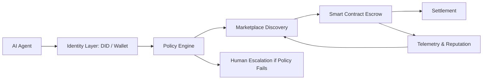

---
title: Autonomous Commerce Networks
repo: future-of-ai-and-web3
primary_keyword: Autonomous Commerce
secondary_keywords:
- Future of AI
- Web3 Research
- Digital Economies
slug: autonomous-commerce-networks
word_count_target: 1200
commit_type: 'research(ai):'---

# Autonomous Commerce Networks: The Next Layer of Decentralized Trade

## Introduction

Autonomous Commerce is the idea that software agents, smart contracts, and decentralized infrastructure can discover needs, negotiate terms, exchange value, and fulfill services with minimal human intervention. For founders and technology leaders, this is not just a speculative concept; it is a practical design pattern emerging from the overlap of AI agents, Web3 rails, and machine-readable payments.

In the context of the Future of AI, autonomous systems are becoming capable of planning, pricing, and executing transactions. Web3 adds verifiable identity, programmable settlement, and ownership primitives. Together, they create the basis for Autonomous Commerce Networks: systems where digital agents can participate in markets as buyers, sellers, coordinators, or service providers.

The strategic question is not whether these networks will exist, but how to architect them safely, efficiently, and economically. Companies that understand the mechanics early will be better positioned to build products for digital economies that are increasingly machine-operated.

## Problem Statement

Traditional commerce systems assume humans are the primary actors. Even when software automates parts of the workflow, the control plane still depends on human approvals, centralized platforms, and manual reconciliation. That model breaks down when autonomous agents begin to transact at scale.

There are four core problems:

1. **Identity and trust**
   - Agents need a way to prove who they are, what they are authorized to do, and whether they have a reliable history.
   - Current login systems are built for people, not machine identities.

2. **Settlement and coordination**
   - Autonomous systems require instant or near-instant payment finality.
   - Conventional payment rails are slow, expensive, and difficult to program for conditional execution.

3. **Market discovery**
   - Agents must find counterparties, compare offers, and negotiate terms in structured formats.
   - Most marketplaces are optimized for human browsing, not machine-to-machine bidding.

4. **Risk and governance**
   - An autonomous agent can overspend, accept bad terms, or trigger unintended actions.
   - Without policy controls, observability, and revocation, the system becomes fragile.

These issues are especially relevant in Web3 Research because public blockchains provide transparency but also introduce new attack surfaces. Autonomous Commerce must balance openness with policy enforcement, otherwise the network becomes easy to exploit.

## Solution

The solution is to treat Autonomous Commerce as a layered system, not a single application. Each layer has a distinct role: identity, policy, discovery, execution, and settlement.

A practical model includes:

- **On-chain identity for agents**
  - Use decentralized identifiers (DIDs), verifiable credentials, or wallet-based identities.
  - Bind agents to scoped permissions, such as spending caps, vendor allowlists, or time-based authorization.

- **Policy engine**
  - Define what the agent can do before it touches funds or external APIs.
  - Policies can include budget ceilings, risk thresholds, compliance rules, and human escalation triggers.

- **Marketplace and discovery layer**
  - Agents publish structured requests for quotes, availability, or service execution.
  - Counterparties respond with machine-readable offers that can be ranked automatically.

- **Smart contract settlement**
  - Once terms are accepted, a contract escrows funds, validates conditions, and releases payment when obligations are met.
  - This reduces disputes and creates auditability.

- **Telemetry and reputation**
  - Every transaction should emit logs, proofs, and reputation signals.
  - Over time, this creates a trust graph for agents and vendors inside the network.

For founders, the key design principle is modularity. Do not build a monolithic “AI commerce platform.” Build composable services that can be replaced as standards mature.

## Architecture or Framework

A robust Autonomous Commerce Network can be organized into five components:

1. **Agent Layer**
   - AI agents perform tasks such as procurement, content licensing, API purchasing, or data acquisition.
   - Agents should operate with constrained permissions and explicit objectives.

2. **Identity Layer**
   - Wallets, DIDs, and verifiable credentials establish machine identity.
   - This layer should support revocation, delegation, and role scoping.

3. **Policy and Compliance Layer**
   - Rules are enforced before a transaction is signed.
   - Policies may inspect counterparty reputation, jurisdiction, token type, or transaction size.

4. **Execution Layer**
   - Smart contracts handle escrow, conditional release, dispute windows, and settlement.
   - Off-chain services can execute tasks while on-chain logic handles finality.

5. **Analytics and Reputation Layer**
   - Transaction history, failure rates, completion times, and dispute outcomes feed a reputation index.
   - This helps agents choose reliable partners and reduce fraud.

A useful implementation pattern is “request, verify, escrow, execute, release.” The agent requests a service, verifies the counterparty, escrows funds, executes the task, and releases payment after proof of completion.

Metrics matter here. Teams should track:
- transaction success rate
- average settlement time
- dispute rate
- policy violation rate
- cost per autonomous transaction
- counterparty reputation drift

These metrics reveal whether the network is scaling safely or simply automating failure.

## Benefits

Autonomous Commerce offers tangible advantages for businesses building in digital economies.

**1. Lower transaction overhead**
Agents can negotiate and execute repetitive purchases without manual review, reducing operational cost and cycle time.

**2. Faster market access**
A machine-readable marketplace enables 24/7 procurement and instant service matching across geographies and time zones.

**3. Better capital efficiency**
Escrow and conditional settlement reduce prepayment risk. Funds are only released when work is verified.

**4. Composable ecosystem growth**
When identity, policy, and settlement are standardized, third-party developers can build specialized agents and services on top of the same rails.

**5. Improved auditability**
On-chain records provide a clear transaction trail, which is valuable for governance, compliance, and dispute resolution.

For the Future of AI, this matters because agents become economic actors rather than just assistants. For Web3 Research, it demonstrates a concrete use case where programmable ownership and settlement create new product categories.

## Challenges

Despite the promise, Autonomous Commerce has several hard problems.

**Security**
Agents can be manipulated through prompt injection, malicious offers, or compromised plugins. If an agent has transaction authority, the blast radius is real. Security controls must include sandboxing, signed actions, and strict policy enforcement.

**Identity spoofing**
A wallet address alone is not enough to establish trust. Networks need credential verification, reputation systems, and anti-sybil mechanisms to prevent fake agents from farming trust.

**Interoperability**
Different chains, wallets, and agent frameworks may not share standards. Without interoperability, the network fragments into isolated silos.

**Legal and compliance uncertainty**
Autonomous transactions may trigger KYC, AML, tax, or consumer protection obligations. Teams must design with jurisdictional constraints in mind, especially for high-value or regulated commerce.

**Economic incentives**
If rewards are misaligned, agents may optimize for transaction volume instead of quality. Reputation systems must resist gaming and reflect real outcomes, not just activity.

The biggest challenge is governance. A network that is too open becomes unsafe; a network that is too controlled loses the benefits of decentralization. The right balance depends on the use case.

## Future Opportunities

Autonomous Commerce is likely to expand in several directions.

**Agent-to-agent procurement**
Software agents will buy compute, data, design assets, and API access from other agents with minimal human involvement.

**Machine-native subscriptions**
Instead of human billing portals, agents will manage budgets dynamically based on workload, utility, and policy limits.

**On-chain identity markets**
Reputation, credentials, and authorization could become portable assets that agents use across multiple networks.

**Dynamic digital economies**
Pricing may become algorithmic, adjusting in real time based on demand, supply, reliability, and risk.

**Specialized commerce protocols**
We will likely see protocols built for specific verticals such as data licensing, inference purchasing, content distribution, and autonomous logistics.

For startups, the opportunity is to own a narrow but critical layer: identity, policy, settlement, or reputation. The winners may not be the largest platforms, but the most trusted infrastructure providers inside the network.

## Conclusion

Autonomous Commerce is a practical direction for the Future of AI and Web3 Research, not a theoretical abstraction. As agents gain planning and execution capabilities, commerce will shift from human-operated workflows to machine-operated networks. The winners will be teams that design for trust, policy, and settlement from the start.

For founders and CTOs, the playbook is clear: build modular systems, constrain agent permissions, use on-chain identity where it adds value, and measure transaction integrity as carefully as revenue. In digital economies, autonomy without governance is a liability, but autonomy with strong infrastructure becomes a new market layer.

## Related Reading

- (pending)