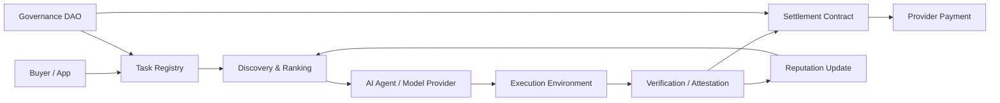

---
title: Decentralized Intelligence Marketplaces
repo: future-of-ai-and-web3
primary_keyword: Decentralized AI
secondary_keywords:
- AI Agents
- Web3 Research
- Emerging Technology
slug: decentralized-intelligence-marketplaces
word_count_target: 1200
commit_type: 'research(ai):'---

# Decentralized Intelligence Marketplaces

## Introduction

**Decentralized AI** is changing how intelligence is produced, priced, and consumed. Instead of relying on a single cloud provider or a closed model API, decentralized intelligence marketplaces allow many participants to contribute models, data, compute, evaluation, and orchestration into a shared economic system. For founders and technology leaders, this matters because the market is moving from selling static software toward coordinating dynamic, composable intelligence services.

A decentralized intelligence marketplace is not just a directory of models. It is an economic and technical layer where **AI Agents** can be discovered, verified, paid, and composed into workflows. These marketplaces are especially relevant in **Web3 Research**, where on-chain identity, tokenized incentives, and transparent settlement can make participation auditable and programmable. As an **Emerging Technology**, this category sits at the intersection of machine learning infrastructure, decentralized coordination, and digital labor markets.

The core question is simple: how do you build a market for intelligence that is open enough to encourage competition, yet reliable enough for production use?

## Problem Statement

Centralized AI platforms create several bottlenecks.

First, they control access to models and pricing. This makes it hard for buyers to compare providers, and it creates dependency on a single vendor’s roadmap, rate limits, and policy decisions. Second, they hide provenance. Users often cannot verify where a model came from, what data trained it, or how it was evaluated. Third, they make agent orchestration proprietary. If an enterprise wants to chain multiple **AI Agents** across different providers, it often must integrate separate APIs, billing systems, and monitoring tools.

For emerging digital economies, this creates a structural problem: intelligence becomes a rented utility controlled by a few platforms rather than a competitive market. That limits innovation in three ways:

- Small providers cannot easily monetize niche models or specialized datasets.
- Buyers cannot benchmark quality across many vendors with consistent metrics.
- Contributors have weak incentives to supply compute, curation, or evaluation because settlement is opaque.

This is where **Decentralized AI** offers a different design. It can distribute ownership, standardize verification, and support open participation. But to work, the system must solve trust, discovery, and settlement at the same time.

## Solution

A decentralized intelligence marketplace combines three layers:

1. **Supply layer**: model builders, data providers, compute operators, and evaluators contribute services.
2. **Coordination layer**: smart contracts, reputation systems, and identity primitives route tasks and manage incentives.
3. **Consumption layer**: developers and enterprises request outputs from models or agent workflows through standardized interfaces.

The practical goal is to make intelligence a tradable service with measurable quality. In a healthy marketplace, a buyer can request a task such as “classify support tickets,” “extract contract clauses,” or “generate research summaries,” and the system can route that task to the best available provider based on price, latency, accuracy, and reputation.

A strong design usually includes:

- **On-chain identity** for providers and agents, so participants can build reputation over time.
- **Verifiable execution** through attestations, proofs, or audit logs.
- **Dynamic pricing** based on demand, task complexity, and provider performance.
- **Escrow and settlement** so payments release only after delivery or validation.
- **Composable agent workflows** where one agent can call another and split revenue automatically.

This is not just an infrastructure pattern. It is a new market structure for intelligence.

## Architecture or Framework

A useful reference architecture for **Decentralized AI** marketplaces includes five components:

1. **Identity and reputation**
   - Wallet-based identities or decentralized identifiers (DIDs)
   - Provider profiles with historical performance, dispute records, and specialization tags
   - Reputation scores derived from completed tasks, client feedback, and verification results

2. **Task registry and discovery**
   - A marketplace contract or registry that lists available models, agents, and services
   - Metadata fields for task type, cost, latency, supported formats, and compliance attributes
   - Search and ranking mechanisms for matching buyer requirements to providers

3. **Execution and verification**
   - Off-chain inference or agent execution in secure environments
   - Result attestation using signed logs, trusted execution environments, or challenge-response checks
   - Optional human review for high-stakes outputs

4. **Settlement and incentives**
   - Escrow contracts for task funding
   - Revenue splitting for multi-agent workflows
   - Staking or slashing for providers that fail quality thresholds

5. **Governance and policy**
   - DAO-style parameter updates for fees, dispute rules, and ranking weights
   - Community voting for protocol upgrades
   - Policy modules for regulated domains such as finance, healthcare, or identity

This framework works best when the marketplace is modular. The registry should not hard-code one model type. Instead, it should support multiple service classes: inference, evaluation, data labeling, retrieval, and multi-step agent orchestration. That flexibility is critical because **Emerging Technology** markets evolve quickly, and the protocol must adapt without rebuilding the entire stack.

For implementation, teams often start with a narrow vertical. For example:

- A research marketplace for literature summarization and citation extraction
- A compliance marketplace for policy review and document classification
- A developer marketplace for code review, test generation, and bug triage

Narrow scope helps establish reliable benchmarks before expanding into a general-purpose network.

## Benefits

The main benefit of a decentralized intelligence marketplace is competition. When many providers can offer the same task, pricing becomes more efficient and buyers can choose based on measurable quality rather than brand lock-in.

Other benefits include:

- **Lower vendor dependence**: Buyers can route work across multiple providers and avoid single-point failure.
- **Better specialization**: Small teams can monetize niche expertise, such as legal reasoning, biotech summarization, or multilingual support.
- **Transparent incentives**: Contributors know how they are paid, what metrics matter, and how reputation accumulates.
- **Composable **AI Agents**: Workflows can be assembled from specialized agents instead of forcing one model to do everything.
- **Open experimentation**: Researchers can test new ranking algorithms, verification methods, and settlement rules in public.

For enterprises, the strongest metric gains often appear in cost per task, latency variance, and quality consistency. For example, a marketplace may reduce average task cost by 20-40% through competition, while also improving uptime by routing around overloaded providers. The exact numbers depend on task type, but the principle is consistent: open markets create pressure for efficiency.

For **Web3 Research**, the broader value is economic coordination. A decentralized system can turn intelligence into a networked asset class where data, models, and agent services interact through programmable contracts rather than closed billing APIs.

## Challenges

The biggest challenge is verification. It is easy to pay for a completed task; it is much harder to know whether the output is correct, original, or safe. This is especially true for generative tasks where quality is subjective.

Other challenges include:

- **Sybil resistance**: Fake identities can game reputation systems unless identity and staking are carefully designed.
- **Benchmark drift**: Static evaluation sets become less useful as providers optimize against them.
- **Latency and cost trade-offs**: Decentralized routing can add overhead compared with direct API calls.
- **Privacy**: Sensitive prompts and data may not be suitable for open execution.
- **Regulatory complexity**: Some tasks require auditability, consent, or jurisdiction-specific controls.
- **Governance capture**: Token-weighted voting can favor large holders over actual users.

These issues mean that a decentralized marketplace should not try to decentralize everything at once. In many cases, the best approach is hybrid: decentralized coordination on top, with selective use of trusted execution, private compute, or permissioned validation underneath. That trade-off is often necessary for production adoption.

## Future Opportunities

Several opportunities are likely to define the next phase of decentralized intelligence marketplaces.

First, **agent economies** will mature. As **AI Agents** become more autonomous, they will not just consume services; they will buy services from other agents. This creates machine-to-machine commerce where agents negotiate price, quality, and deadlines on behalf of users.

Second, on-chain identity will become more important. A strong identity layer can support portable reputation across marketplaces, making it easier for high-quality providers to move between networks without starting from zero.

Third, verification will improve through better cryptographic and systems techniques. Expect more use of attestations, zero-knowledge proofs for certain claims, and secure enclaves for sensitive workloads.

Fourth, marketplaces will become more domain-specific. Generic model exchanges are useful, but the strongest businesses will likely focus on regulated or high-value workflows where trust, provenance, and settlement matter most.

Finally, tokenized incentives may evolve from speculative rewards into practical economic rails. In mature systems, tokens should support staking, dispute resolution, and governance rather than acting only as marketing tools.

For founders, the opportunity is to define the market structure before it hardens. The winners in **Decentralized AI** will not only build better models; they will build better coordination systems for distributing intelligence.

## Conclusion

Decentralized intelligence marketplaces represent a shift from centralized AI access toward open, programmable markets for models, data, compute, and **AI Agents**. Their promise is not abstract decentralization, but practical improvements in pricing, specialization, transparency, and resilience.

The architecture is clear enough to prototype today: identity, discovery, execution, verification, settlement, and governance. The hard part is not building a marketplace contract; it is designing incentives and quality controls that make the market trustworthy at scale. That is why this topic sits at the center of **Web3 Research** and broader **Emerging Technology** strategy.

For technology leaders, the right question is no longer whether decentralized intelligence marketplaces will exist. It is where they will create the first durable economic advantage, and which vertical will prove the model with real usage, measurable quality, and sustainable incentives.

## Related Reading

- (pending)